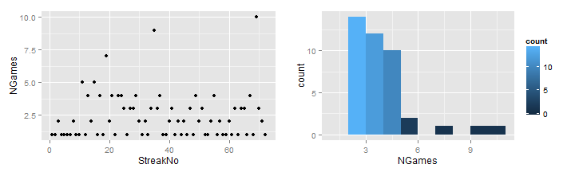

```
## Warning: NAs introduced by coercion
```


## The Atlanta Braves Season Explorer

<b>presented by Daniel Moore...</b>

* Data from 1975 - 2013
* <a href="https://dfmoore.shinyapps.io/Atlanta_Braves_Season_Explorer/">Located here</a>
* demonstrations of charts here are from the 1998 season


--- .class #montreal 

# Functionality
The Season Explorer is very easy to use.
Simply select a year from the drop down box and four charts are created, giving an overview of the ups and downs of the season along with a summary of the season highlights

1. Total number of wins and losses
2. Season trend chart, showing how many games above or below .500 the team was as the season progressed
3. Streak analyzer - showing the streaks that the team had as the season progressed and how long it lasted
4. Distribution of the length of streaks - just how streaky was the team in any given season?


--- .class #id 

# Notes and Wins/Losses
The main purpose of this chart is to show the total number of wins and losses for the season.

* Losses are in red, on the left of the chart
* Wins are in blue, on the right side of the chart

A good season, of course, consists of vastly more wins than losses :)

 


--- .class #id 

# Season Trends

The baseball season is a long season (162 games!). One way to envision the story of that season is to look at the number of games that the team is above .500 as the season progresses. It's a good way to see the ups and downs of the season, when the team surged and when it slipped, and how consistent the team was throughout the year.


```
## Warning: Removed 9 rows containing missing values (geom_point).
```

 


--- .class #id

# Streak Analyzers

Some years, teams are streakier than other years, they tend to have long stretches of winning and losing as opposed to more consistency. One way to see how *streaky* a team is during a season is to look at the length of streaks throughout the season, both as the season progresses, as in the first chart and as a distribution, as in the second chart. These charts give a quick overview of this (removing the most common case of streaks of length 1).


```
## stat_bin: binwidth defaulted to range/30. Use 'binwidth = x' to adjust this.
```

 

